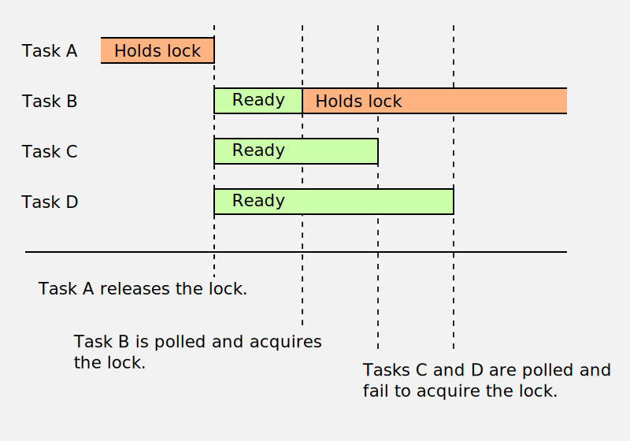
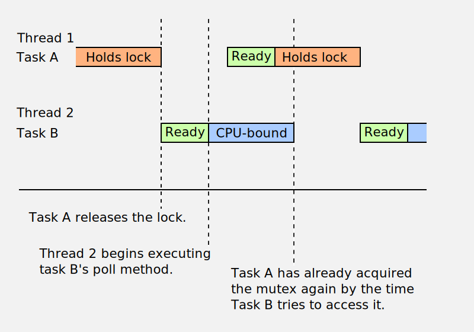
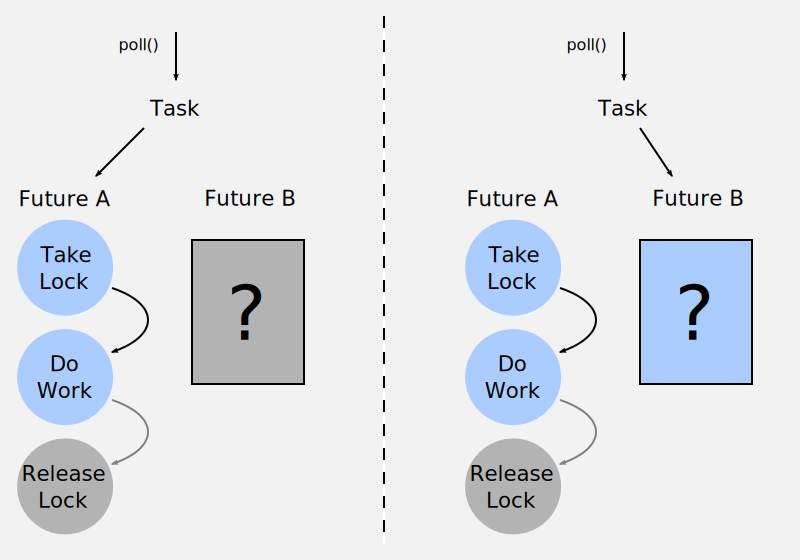
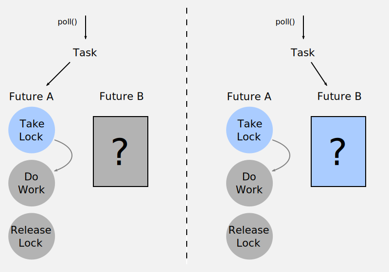
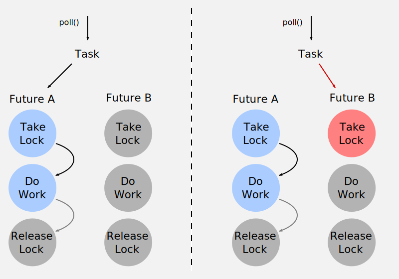

# Async Mutexes

As Rust's `async` ecosystem grows, there's an increasing need for a set of concurrency
primitives, similar to those found in `std::sync`, but suitable for use in async code.

In this post I'm going to be looking at a single concurrency primitive: [the mutex].
This deceptively simple primitive turns out to be a nightmare to translate to the async
world, and it reveals some of the darker corners of async programming.

[the mutex]: https://en.wikipedia.org/wiki/Mutual_exclusion

## Why not just use `std::sync::Mutex`?

The standard `Mutex` is definitely usable from async code, but it comes with an
important constraint: you must not hold the mutex across a yield point.

If you yield from a piece of async code whilst holding a lock, the executor will
poll another task on that same thread. If this new task also tries to lock the mutex,
then neither task will be able to progress: the whole thread is blocked, so the original
task will have no opportunity to continue and release the lock.

## Avoiding complexity

For these code examples, I'm going to simplify things as much as possible:

- The mutex will not protect any data. This avoids some generics which aren't
  relevant for the locking mechanism itself.

- There will be no `MutexGuard` for RAII-style access, just `lock` and `unlock`
  methods, and I will not try to enforce that they are used correctly.

- No low-level optimisations have been applied. I am only considering performance
  of the algorithm itself, not paying attention to implementation details.

- I will ignore mutex poisoning.

All of the example code listed here compiles in the [Rust playground]!

[Rust playground]: https://play.rust-lang.org/

## The care-free implementation

Given those caveats, let's have our first attempt at writing an async mutex.

We'll store a simple boolean value for whether the mutex is locked, and we'll
keep a list of tasks waiting on the mutex so we know who to wake up when the
mutex is unlocked.

We'll protect this state using a standard mutex, but this is OK because we
never yield whilst it is locked.

```rust
use std::collections::HashMap;
use std::task::{Poll, Waker, Context};
use std::sync::{Arc, Mutex};
use std::future::Future;
use std::pin::Pin;

// This is our async mutex type. We use a standard mutex to protect
// our inner state.
#[derive(Default)]
pub struct AsyncMutex {
    inner: Arc<Mutex<Inner>>
}

#[derive(Default)]
struct Inner {
    // Basic mutex state
    locked: bool,
    waiting_tasks: HashMap<LockId, Waker>,

    // This is just a convenient way to generate unique IDs to
    // identify waiting tasks.
    next_id: LockId,
}

type LockId = usize;

impl AsyncMutex {
    // This begins the lock operation: polling the returned future
    // will attempt to take the lock.
    pub fn lock(&self) -> LockFuture {
        let mut inner = self.inner.lock().unwrap();
        
        // Generate a unique ID for this lock operation
        // We won't worry about integer overflow for this example.
        let id = inner.next_id;
        inner.next_id += 1;

        LockFuture { inner: self.inner.clone(), id, done: false }
    }

    // Unlocking can be done synchronously.
    pub fn unlock(&self) {
        let mut inner = self.inner.lock().unwrap();
        
        assert!(inner.locked);
        inner.locked = false;
        
        // Wake up all the tasks waiting on this mutex
        for (_, waker) in inner.waiting_tasks.drain() {
            waker.wake();
        }
    }
}

// This future completes when we have taken the lock.
pub struct LockFuture {
    id: LockId,
    inner: Arc<Mutex<Inner>>,
    done: bool,
}

impl Future for LockFuture {
    type Output = ();
    fn poll(self: Pin<&mut Self>, ctx: &mut Context) -> Poll<()> {
        let this = self.get_mut();
    
        assert!(!this.done, "Future polled after completion");
    
        let mut inner = this.inner.lock().unwrap();

        if !inner.locked {
            // Nobody has the lock, so take it for ourselves
            inner.locked = true;
            inner.waiting_tasks.remove(&this.id);
            this.done = true;
            
            Poll::Ready(())
        } else {
            // Someone else has the lock, so queue ourselves to be woken up.
            // We use a fixed ID, so if we already queued ourselves we'll
            // overwrite that entry with the new waker.
            inner.waiting_tasks.insert(this.id, ctx.waker().clone());
            Poll::Pending
        }
    }
}
```

## The "[thundering herd]" problem

The first issue with this mutex is that when it's unlocked, we wake up *all* of the
tasks waiting on the mutex. If there is a lot of contention for the mutex, then this
is very inefficient, because only one of the tasks we wake up will actually be able
to take the lock.



We could try to fix it by changing our `unlock()` implementation to wake a single
task:

```rust
    pub fn unlock(&self) {
        let mut inner = self.inner.lock().unwrap();
        
        assert!(inner.locked);
        inner.locked = false;
        
        // Wake up a single task waiting on this mutex
        if let Some(&id) = inner.waiting_tasks.keys().next() {
            let waker = inner.waiting_tasks.remove(&id).unwrap();
            waker.wake();
        }
    }
```

However, this leads to a new problem: what if the task we woke up doesn't exist
anymore? It will never try to take the lock, and the other tasks will be stuck
waiting for a mutex indefinitely.

We can try to remedy this too:

```rust
impl Drop for LockFuture {
    fn drop(&mut self) {
        if !self.done {
            let mut inner = self.inner.lock().unwrap();
    
            // Wake up a single task waiting on this mutex
            if let Some(&id) = inner.waiting_tasks.keys().next() {
                let waker = inner.waiting_tasks.remove(&id).unwrap();
                waker.wake();
            }
        }
    }
}
```

This way, if a task was cancelled whilst trying to take a lock, we'll ensure
another task is woken up. Now everything should be fine... right? Not quite,
but let's look at some other problems first!

[thundering herd]: https://en.wikipedia.org/wiki/Thundering_herd_problem


## The fairness problem

When building a mutex, we want it to be fair: in other words, even if there's
a lot of contention, every task should gets its chance to take the mutex. We don't
want any tasks to be starved.

Unfairness is not always a deal-breaker. However, our mutex is *very* unfair. Firstly,
the order of items in a `HashMap` is not random: if a lock operation is unlucky enough
to get an ID which maps to a slot near the end of the `HashMap`, the task performing
that operation will have to wait a long time to get woken up.

We can try to fix this by switching from a `HashMap` to a queue:

```diff
-    use std::collections::HashMap;
+    use std::collections::BTreeMap;
...
-    waiting_tasks: HashMap<LockId, Waker>,
+    waiting_tasks: BTreeMap<LockId, Waker>,
```

A useful side effect of our sequential ID generation is that a `BTreeMap` will behave like
a queue, so we don't have to change anything else.

---

At this point, we've reached something functionally equivalent to the async mutex
provided by the `futures` crate: [`futures::lock::Mutex`], albeit nowhere near as
performant.

---

However, there is a second source of unfairness: consider a task which polls several
futures before polling the lock future:

```rust
future1.poll(ctx);
future2.poll(ctx);
...
futureN.poll(ctx);
lock_future.poll(ctx);
```

Every time it wakes up, it polls these other futures first. During that period another
thread can sneak in and take the mutex. This is because `lock()` always succeeds
immediately if the mutex is free: we don't check whether another task has been waiting
for ages already.



Solving this problem is a little more involved: when we release a mutex, we should
immediately lock it on behalf of the next waiting task so that nobody else can steal
it in the meantime.

```diff
-    locked: bool,
+    locked_by: Option<LockId>,
```

```rust

impl Future for LockFuture {
    type Output = ();
    fn poll(self: Pin<&mut Self>, ctx: &mut Context) -> Poll<()> {
        let this = self.get_mut();
    
        assert!(!this.done, "Future polled after completion");
        let mut inner = this.inner.lock().unwrap();

        match inner.locked_by {
            Some(id) if id != this.id => {
                // Someone else has the lock, so queue ourselves to be woken up
                inner.waiting_tasks.insert(this.id, ctx.waker().clone());
                Poll::Pending
            },
            _ => {
                // Either nobody has the lock, or we were given the lock by
                // another task, so return success.
                inner.locked_by = Some(this.id);
                inner.waiting_tasks.remove(&this.id);
                this.done = true;
                
                Poll::Ready(())
            }
        }
    }
}

impl Drop for LockFuture {
    fn drop(&mut self) {
        if !self.done {
            let mut inner = self.inner.lock().unwrap();
    
            // If we were given the lock by another task,
            // make sure to unlock it.
            if inner.locked_by == Some(self.id) {
                inner.unlock_inner();
            }
        }
    }
}

impl AsyncMutex {
    pub fn unlock(&self) {
        let mut inner = self.inner.lock().unwrap();
        inner.unlock_inner();
    }
}

impl Inner {
    fn unlock_inner(&mut self) {
        assert!(self.locked_by.is_some());
        
        // Wake up a single task waiting on this mutex
        if let Some(&id) = self.waiting_tasks.keys().next() {
            self.locked_by = Some(id);
            let waker = self.waiting_tasks.remove(&id).unwrap();
            waker.wake();
        } else {
            self.locked_by = None;
        }
    }
}
```

---

At this point, we've reached something functionally equivalent to the async mutex
provided by the `tokio` crate: [`tokio::sync::Mutex`], albeit nowhere near as
performant.

---


[`futures::lock::Mutex`]: https://docs.rs/futures/0.3.4/futures/lock/struct.Mutex.html
[`tokio::sync::Mutex`]: https://docs.rs/tokio/0.2.20/tokio/sync/struct.Mutex.html

## The laziness problem

If we were writing our mutex for use with Javascript's async model, everything
would be working fine! However, we're not, and everything is not fine... It's
time to look at the problem I hinted at earlier on!

A Javascript promise does not need to be "spawned" - it exists by itself and
will run to completion without any prompting. However, a Rust future must be
explicitly driven to completion, by composing it into a task and then spawning
that task onto an executor.

So far, we've been assuming that a future will, after its task is woken up, either
be polled or dropped promptly. However, the async model does not guarantee this.
It is perfectly valid for a task to poll a future, stop polling it for a period
of time, and then start polling it again.

This causes two obvious problems:

1) A task may stop polling the future which took the lock before it has a chance
   to release it. This affects all versions of our mutex we've built so far.

   

2) A task may stop polling the future whilst it is in the process of taking the
   lock. This affects all the fair versions of our mutex.

   

In both cases, the result is that nobody else will be able to access the mutex
until this future is polled or dropped.

There is also a third problem which is both more subtle and much nastier:

3) A task may own two futures which both try to lock the mutex. If the order
   in which these futures are polled can change, and the task returns as soon
   as the first future returns `Pending`, then the task can deadlock itself.

   

## Understanding laziness and how it affects futures

Why do these problems afflict `LockFuture`, but not other kinds of future?
If we are writing a new kind of future, how do we know that it won't have the
same issues?

I've found it very difficult to explain precisely what is wrong: every rule
seems to have some exceptions. Intuitively the problem seems to be caused by
side-effects: polling (or rather, failing to poll) a `LockFuture` interferes
with the execution of other futures.

However, there are lots of futures that have side effects: for example, reading
from a file will advance the file pointer. There are even examples of futures
blocking the completion of others: failing to send on a `channel` will of
course block the other side of that channel from progressing, and it's entirely
possible to create deadlocks as a result, where the sending side is blocked
on a receive from the same channel. You can end up with a similar problem to
the mutex if both the "send" and "receive" futures are composed onto the same
task.

Ultimately, I think it comes down to expectations: we expect there to be a
dependency between two ends of a channel. We don't expect (and can't easily
predict) a dependency between two otherwise unrelated pieces of code that
happen to access shared state via a mutex. If a set of futures use a mutex
internally, we would like to be able to compose those futures without needing
to worry about those implementation details.

## Solutions to the laziness problem

### Change the async guarantees

The idea is that we simply require all combinators and tasks to poll or drop
futures promptly after they are woken up.

#### Advantages

- Does not require any changes to our mutex.

#### Disadvantages

- It's very difficult to define what "poll promptly" actually means in practice, and
  impossible to verify it automatically.
- It's a rule that must be followed by all async code, it can't just be encapsulated
  in a library implementation.
- Does not play well with CPU-bound tasks - it's not clear if CPU-bound tasks
  would even be compatible with this rule.

### Force code accessing a mutex to be spawned as a task

The problems we've encountered were caused because the futures on their own are
lazy, and because we have no control over how they will be composed into a task
to be executed. We can solve these problems by forcing code accessing a mutex
to be directly spawned as a task (ie. prevent it from being composed with
other futures first).

We can simplify things further by observing that only one of these tasks
will ever be executing at once, so we could spawn a single task when the
mutex is created, and have that task poll each future which needs to access
the mutex in sequence.

#### Advantages

- Works nicely with CPU-bound tasks. The mutex task can be scheduled to an executor
  that specializes in having low latency, regardless of the executor used by the
  calling code. Executors running CPU-bound tasks will generally have high latency
  in comparison.
- No rules for end-users to follow.
- Very simple to implement.

#### Disadvantages

- Access to the mutex will require its own scope, not just a RAII guard.
- The mutex needs to be able to spawn tasks onto the executor.

Example implementation:

```rust
use std::future::Future;
use std::pin::Pin;

use futures::channel::{oneshot, mpsc};
use futures::{StreamExt, TryFutureExt};

// An arbitrary future to run whilst the mutex is held
type ItemType = Pin<Box<dyn Future<Output=()> + Send + 'static>>;

pub struct AsyncMutex {
    tx: mpsc::UnboundedSender<ItemType>,
}

impl AsyncMutex {
    pub fn new() -> Self {
        let (tx, rx) = mpsc::unbounded();
        tokio::spawn(rx.for_each(|x| x));
        
        Self { tx }
    }
    pub fn lock<F>(&self, f: impl FnOnce() -> F + Send + 'static)
        -> impl Future<Output=F::Output>
    where
        F: Future + Send + 'static,
        F::Output: Send
    {
        // First create a channel to receive the result
        let (tx, rx) = oneshot::channel();
        
        // Send the function to the mutex task to be executed
        self.tx.unbounded_send(Box::pin(async move {
            // Await the function and send back the result
            let _ = tx.send(f().await);
        })).unwrap();

        // Panic if the other side of the channel was closed
        rx.unwrap_or_else(|_| panic!())
    }
}
```

In practice, the `FnOnce` passed into `lock()` would take a single argument,
which would be a mutable reference to the data protected by the mutex:

```rust
use std::future::Future;
use std::pin::Pin;

use futures::channel::{oneshot, mpsc};
use futures::{StreamExt, TryFutureExt};

// An arbitrary mutation to apply to the mutex state
type ItemType<T> = Box<dyn FnOnce(T) -> Pin<Box<dyn Future<Output=T> + Send>> + Send>;

pub struct AsyncMutex<T> {
    tx: mpsc::UnboundedSender<ItemType<T>>,
}

impl<T: Send + 'static> AsyncMutex<T> {
    pub fn new(value: T) -> Self {
        let (tx, rx) = mpsc::unbounded();
        tokio::spawn(rx.fold(value, |value, f: ItemType<T>| f(value)));
        
        Self { tx }
    }
    pub fn lock<F>(&self, f: impl FnOnce(&mut T) -> F + Send + 'static)
        -> impl Future<Output=F::Output> + '_
    where
        F: Future + Send + 'static,
        F::Output: Send
    {
        // First create a channel to receive the result
        let (tx, rx) = oneshot::channel();
        
        // Send the function to the mutex task to be executed
        self.tx.unbounded_send(Box::new(|mut value: T| Box::pin(async move {
            // Await the function and send back the result
            let _ = tx.send(f(&mut value).await);
            value
        }))).unwrap();

        // Panic if the other side of the channel was closed
        rx.unwrap_or_else(|_| panic!())
    }
}
```

The solution we've ended up with has a lot of parallels with the actor model:
instead of multiple tasks vying for access to a shared resource, we have a
single task which owns its own state, and fairly and efficiently applies a
sequence of mutations to that state in response to messages from other tasks.

## Conclusion

This is as far as I've got investigating possible mutex solutions. Perhaps
you can think of some other ways to address the problems I laid out that
come with different trade-offs!
