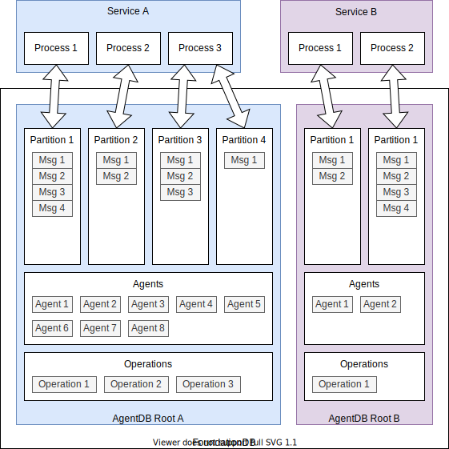
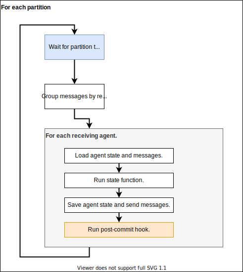

# Part 3. AgentDB

## Goals

- Eliminate failure modes *within* the system.
- Allow business logic to be expressed directly and succinctly.
- Ensure business logic can be tested easily.
- Unlimited horizontal scaling.
- Within a constant factor of performance we might attain with other solutions.
- General purpose.
- Enable backup and restore.

## Non-goals

- Achieve the best possible performance.
- Surpass specialized tools.

## Implementation

AgentDB is a FoundationDB *layer*, and is used as a client library
by stateless services which can be independently scaled:

The concepts in AgentDB are:

- Agents

    These have their own state. The state changes over time in response to
    messages received by the agent, according to the agent's *state function*.

- Messages

    These are partitioned according to the receiving agent, so for a given agent,
    all of its messages will belong to the same partition. Messages are guaranteed
    to be delivered *exactly once*.

    Each message also belongs to an operation.

- Operations

    These are used for tracing and to prevent unintentional feedback loops within
    the system. Each operation has a certain budget, which slowly increases over time.
    Sending a message eats into that budget.

- State function

    This is a pure function which takes the following inputs:

    - The current state of the agent.
    - The list of messages in the agent's inbox.

    And produces the following outputs:

    - The new state of the agent.
    - The list of messages to send to other agents.
    - A side-effectful post-commit hook.

- Clients

    These are processes which connect to a given AgentDB root and provide the
    implementation of the *state function* for agents within that root. AgentDB
    automatically assigns partitions to active clients, such that at any one time,
    every partition is owned by exactly one client.

    Each client waits for messages to appear in any of the partitions it owns.
    The client first groups messages according to the receiving agent. It then
    loads the agent's current state, along with all the messages for that agent.
    It runs the *state function* to produce the new state and a set of messages
    to send. These are then saved back into the database.

    Finally, if everything committed successfully, the post-commit hook is run.

    

- Root

    This is an "instance" of AgentDB. All agents within the same root evolve
    according to the same *state function*, and are processed by the same set of
    clients.

    That said, since we have a shared transactor, there is no problem sending
    messages from agents in one root to agents in another: none of the guarantees
    are weakened in that case.

## Achievement of goals

- Eliminate failure modes within the system.

    AgentDB guarantees exactly-once delivery of all messages with no additional
    effort from the application. This is thanks to FoundationDB's transactor.

- Allow business logic to be expressed directly and succinctly.

    Glue code, such as retry-logic for communication with external systems, can
    be completely encapsulated by reusable agents. The focus of the developer
    can be entirely on how the business logic itself is implemented.

- Ensure business logic can be tested easily.

    Since the *state function* is a pure function, it's trivial to extensively
    unit test every single agent without even needing a real database. There's
    no need to mock anything, since the inputs and outputs (with the exception
    of the post-commit hook) are pure data.

    Post-commit hooks are more difficult to test, but luckily these are only
    needed when communicating with an external system, and can be implemented
    once and reused for all such communication.

- Unlimited horizontal scaling.

    FoundationDB is inherently distributed. AgentDB itself will automatically
    re-assign partitions as clients come and go, so scaling is trivial.

    If it's necessary to scale beyond the current number of partitions in a
    root, it is possible to re-partition the database on the fly, with only
    a brief pause to message processing.

- Within a constant factor of performance we might attain with other solutions.

    The unit of concurrency in AgentDB is the agent: a given agent will process
    all messages sequentially, but any number of agents can execute in parallel.
    The asynchronous nature of this approach means that there is no lock contention,
    and no transaction conflicts during normal operation.

    As throughput increases, the efficiency of the workers also increases,
    since multiple messages can be processed after loading an agent's state only
    once.

    Together, these should mean that our "big O" complexity is pretty optimal - we
    just might have some bigger constant factors than other solutions.

- General purpose.

    Many problems can be expressed as a set of communicating agents. When this
    is not an appropriate model, it is possible to mix in usage of other
    FoundationDB layers.

    Some of these layers can themselves be exposed through an agent-based
    abstraction. For example, AgentDB itself implements an "index" agent, which
    allows efficient lookups of other agents via an arbitrary key. The data
    backing such an index would be too large to store directly within the agent
    state, so this agent uses FoundationDB directly, but queries and updates
    to the index are performed via normal AgentDB messages.

- Enable backup and restore.

    Since all persistent state is kept within FoundationDB, backing up and
    restoring everything works just fine.

